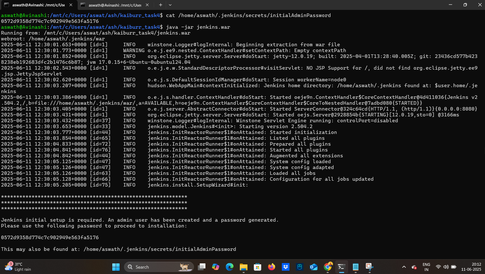
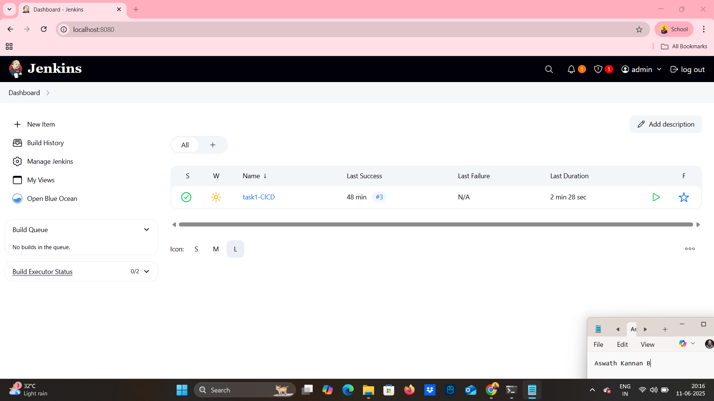
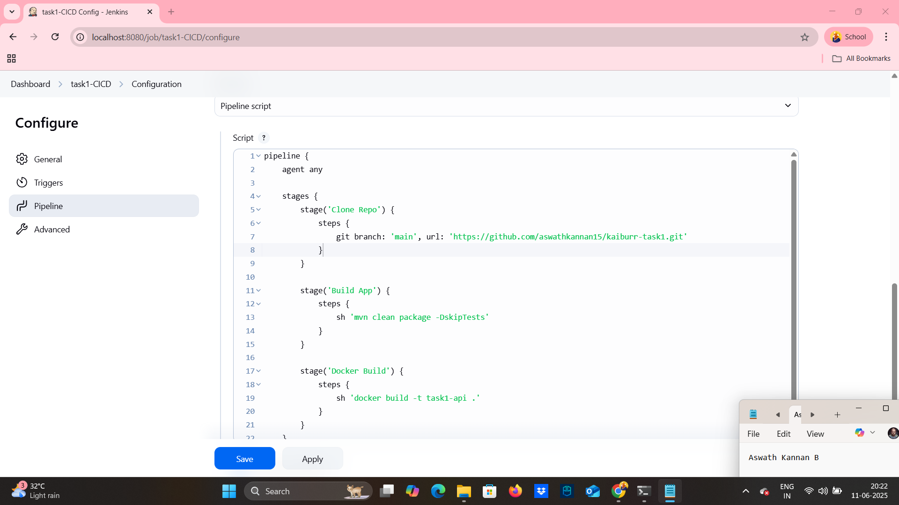
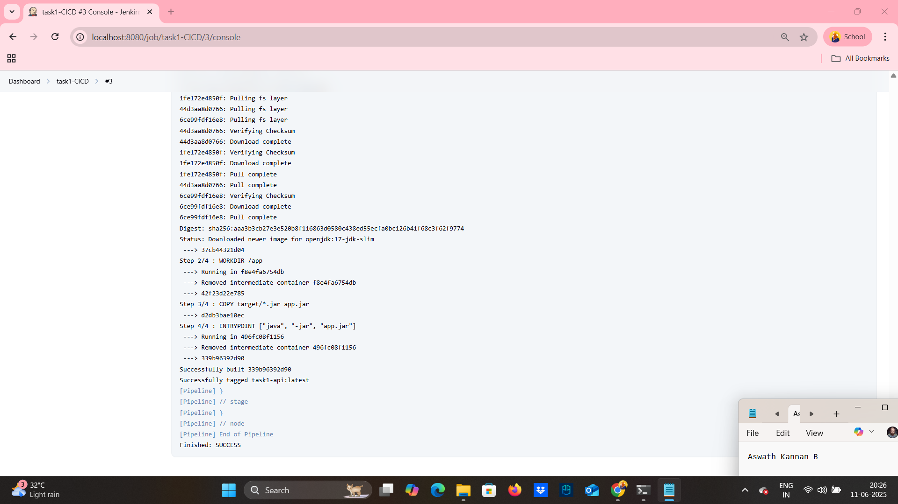
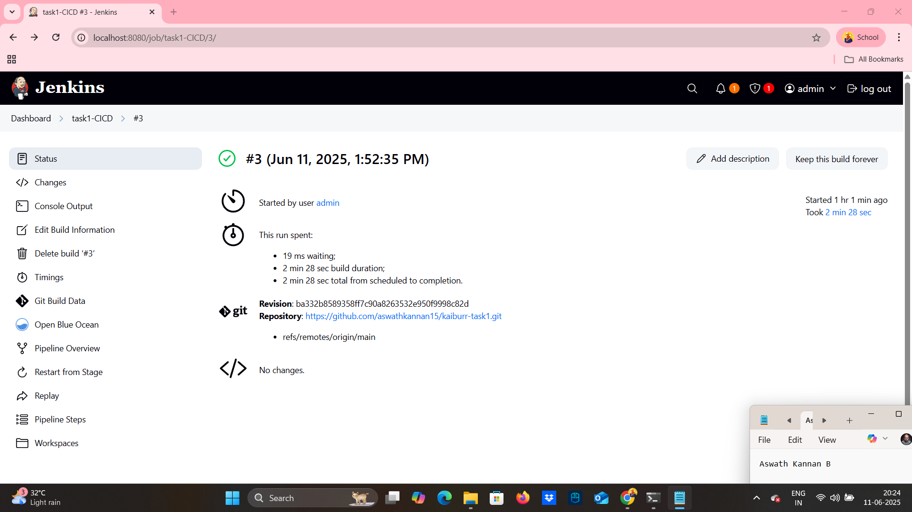

# Task 4. CI-CD Pipeline

This project demonstrates setting up a basic CI/CD pipeline using **Jenkins**, **Maven**, and **Docker** manually on **WSL (Ubuntu)**.

1. **Cloning Source Code** from GitHub
2. **Building the Application** using Maven
3. **Creating a Docker Image** for the built JAR

> Source code used in this project:  
🔗 https://github.com/aswathkannan15/kaiburr-task1

---
##  Tools Used

- **Java 17 (OpenJDK)**
- **Maven**
- **Docker**
- **Jenkins (manual WAR setup)**
- **WSL (Ubuntu on Windows)**
---
## WSL(Windows Subsystem for Linux)

### Why WSL Was Used?
- Use Linux-compatible tools (like Docker, Git, Maven, Jenkins) more easily
= Avoid compatibility issues that arise when using tools like Jenkins and Docker natively on Windows
= Run shell commands (sh, apt, etc.) in the Jenkins pipeline stages without modification

### Setup Instructions (WSL)

```bash
sudo apt install openjdk-17-jdk -y
sudo apt install maven -y
sudo apt install git -y
sudo apt install docker.io -y
sudo usermod -aG docker $USER
newgrp docker
docker version
wget https://get.jenkins.io/war-stable/latest/jenkins.war
java -jar jenkins.war
```
---
## Jenkins Pipeline Stages

| Stage         | Description                                               |
|---------------|-----------------------------------------------------------|
| Clone Repo    | Clones the GitHub repo from the `main` branch             |
| Build App     | Compiles code and packages into a `.jar` file using Maven |
| Docker Build  | Builds a Docker image tagged `task1-api` from Dockerfile  |

---
## CI/CD Screenshots of my work

#### 1.WSL Terminal Setup

#### 2.Jenkins Dashboard Overview

#### 3.Jenkins Pipeline Script Configuration

#### 4.Docker Image Built Successfully (task1-api)

#### 5.Jenkins Console Output Log

#### 6.Detailed Pipeline Execution Steps

#### 7.Pipeline Overview in Jenkins

#### 8.Pipeline Status – Successful Execution Confirmation

---
## Author

### Name: Aswath Kannan B


